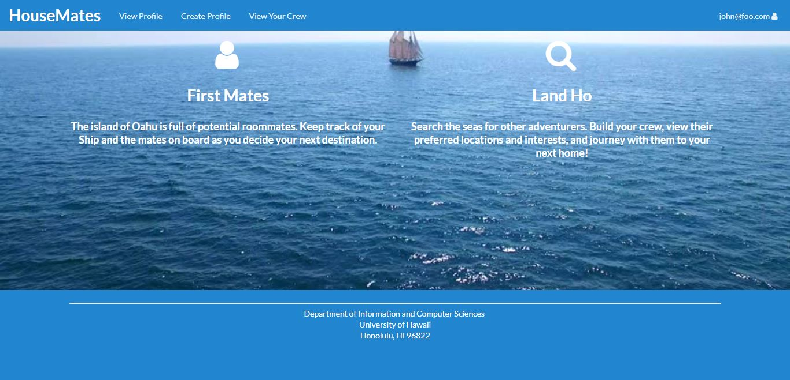
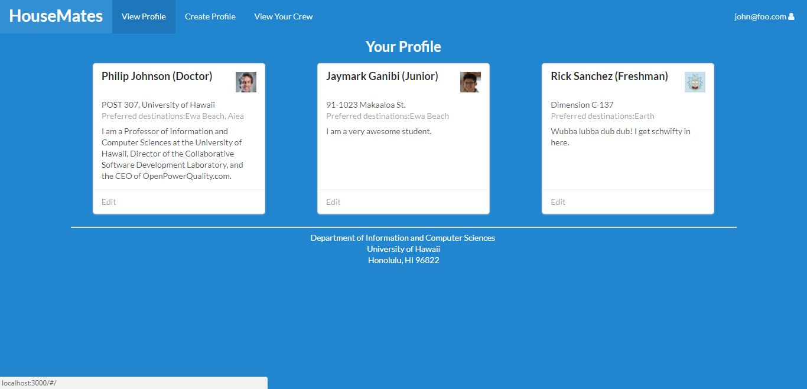
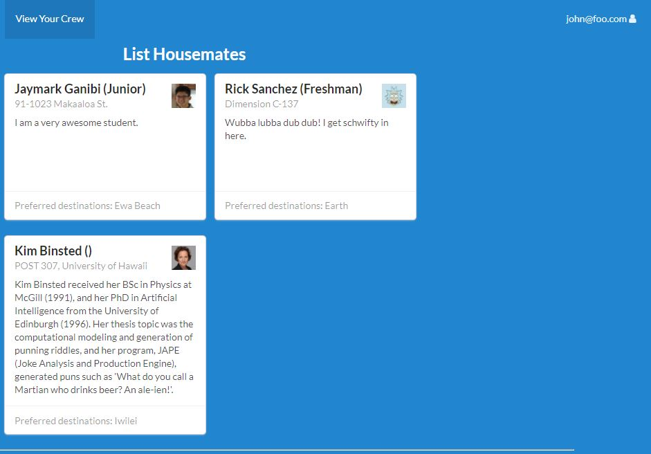

# Table of contents

* [About Housemates](#about-housemates)
* [Installation](#installation)
* [Development history](#development-history)
  * [Milestone 1: Mockup development](#milestone-1-mockup-development)

# About Housemates

[Housemates](https://github.com/housemates) is an in-progress Meteor application that provides the University of Hawaii community with a means to collaborate on finding off-campus housing. When you come to the site, you are greeted by the landing page.

Anyone with a U.H. account can login to Housemates by clicking on the login button. The U.H. CAS authentication screen then appears and requests your U.H. account and password. Once authenticated, you can create a profile that provides your location, preferences for your housing location, and preferences for roommates.

After creating a profile, you will be listed on the public directory page. We also intend for Housemates to provide a filter page, which will allow logged in U.H. users to search for other U.H. users according to the searcher's specified criteria (criteria including location, profile descriptions, roommate preferences, etc.).

# Installation

First, [install Meteor](https://www.meteor.com/install).

Second, download a copy of Housemates, or clone it using git.
  
Third, cd into the app/ directory and install libraries with:

```
$ meteor npm install
```

Fourth, run the system with:

```
$ meteor npm run start
```

If all goes well, the application will appear at [http://localhost:3000](http://localhost:3000). You may 

# Development History

In accordance with [Issue Driven Project Management](http://courses.ics.hawaii.edu/ics314f16/modules/project-management/) practices, development for Housemates consists of a sequence of Milestones. Milestones consist of issues corresponding to 2-3 day tasks. GitHub projects are used to manage the processing of tasks during a milestone.  

The following sections document the development history of Housemates, the results of which are [deployed on Galaxy](http://housemates.meteorapp.com).

## Milestone 1: Mockup development

[Milestone 1](https://github.com/housemates/housemates/projects/1) was started on April 2, 2018 and was finished on April 12, 2018.

The goal of Milestone 1 is to create a set of HTML pages providing a mockup of the pages in the system. To simplify things, the mockup was developed as a Meteor app. This meant that each page was a template and that FlowRouter was used to implement routing to the pages. 

When logging in to House Mates, the user is directed to the Landing Page:



The navigation bar at the top of the screen provides options including viewing his public profile and editing that profile:



We intend to implement a search system so that registered users can find and get in touch with each other, 
users will be able to add others to their "Crew" to keep track of each other's preferred locations for housing, class stadning in 
college, and other basic information.



## Milestone 2: Beginning of New Features
[Milestone 2](https://github.com/housemates/housemates/projects/3) was started on April 12, 2018 and is ongoing.

This milestone will have us start implementing our own original features for the project, such as searching for other users and 
adding them to the user's "Crew", which allows users to keep track of each other as potential roommates.
