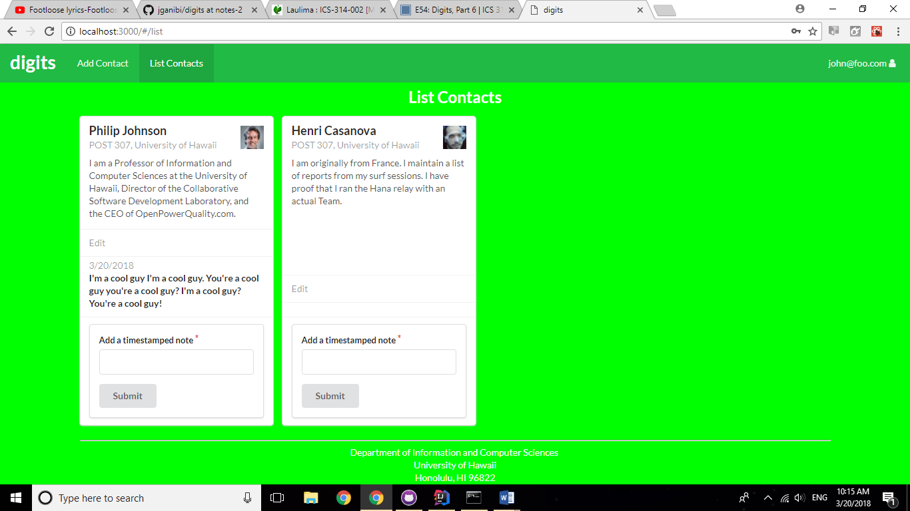
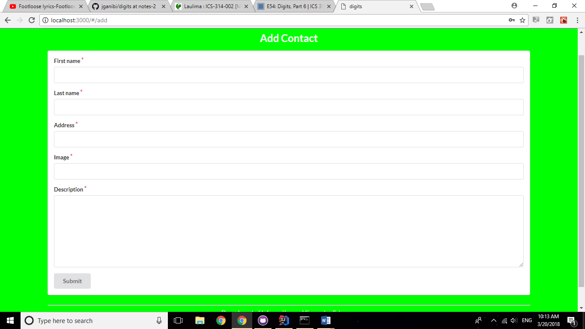

# Table of contents

* [About Housemates](#about-housemates)
* [Installation](#installation)
* [Development history](#development-history)
  * [Milestone 1: Mockup development](#milestone-1-mockup-development)

# About Housemates

Housemates is an in-progress Meteor application that provides the University of Hawaii community with a means to collaborate on finding off-campus housing. When you come to the site, you are greeted by the landing page.

Anyone with a U.H. account can login to Housemates by clicking on the login button. The U.H. CAS authentication screen then appears and requests your U.H. account and password. Once authenticated, you can create a profile that provides your location, preferences for your housing location, and preferences for roommates.

After creating a profile, you will be listed on the public directory page. We also intend for Housemates to provide a filter page, logged in UH users. The filter page allows you to search for other UH users according to the searcher's specified criteria:

# Installation

First, [install Meteor](https://www.meteor.com/install).

Second, download a copy of Housemates, or clone it using git.
  
Third, cd into the app/ directory and install libraries with:

```
$ meteor npm install
```

Fourth, run the system with:

```
$ meteor npm run start
```

If all goes well, the application will appear at [http://localhost:3000](http://localhost:3000). If you have an account on the UH test CAS server, you can login.  

# Development History

In accordance with [Issue Driven Project Management](http://courses.ics.hawaii.edu/ics314f16/modules/project-management/) practices, development for Housemates consists of a sequence of Milestones. Milestones consist of issues corresponding to 2-3 day tasks. GitHub projects are used to manage the processing of tasks during a milestone.  

The following sections document the development history of Housemates.

## Milestone 1: Mockup development

This milestone started on April 2, 2018 and is ongoing.

The goal of Milestone 1 is to create a set of HTML pages providing a mockup of the pages in the system. To simplify things, the mockup was developed as a Meteor app. This meant that each page was a template and that FlowRouter was used to implement routing to the pages. 

Mockups for the following pages will be implemented during M1, and are from the Digits web project:

List Contact:



Add Contact:


