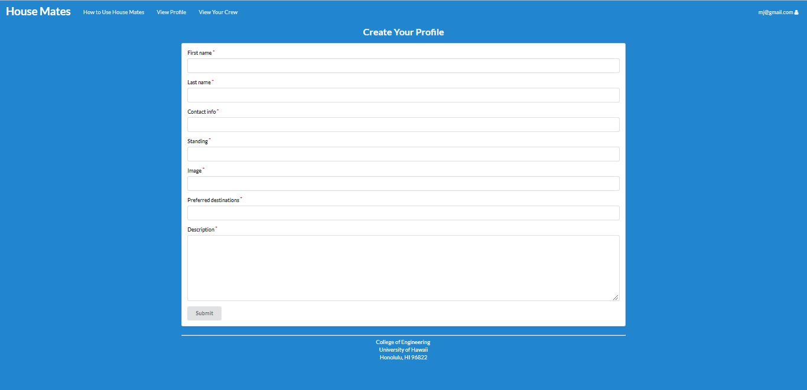
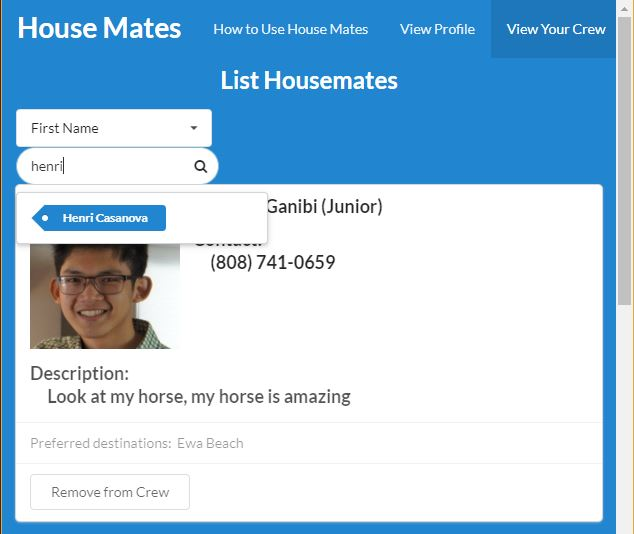

# Table of contents

* [About Housemates](#about-housemates)
* [Installation](#installation)
* [Guided Tour](#guided-tour)
* [Initial User Study](#initial-user-study)
* [Developer Guide](#developer-guide)
  * [Milestone 1: Mockup development](#milestone-1-mockup-development)
  * [Milestone 2: Beginning of New Features](#milestone-2-beginning-of-new-features)
  * [Milestone 3: Finalize Project](#milestone-3-finalize-project)

# About Housemates

[Housemates](https://github.com/housemates) is a Meteor application that provides the University of Hawaii community with a means to collaborate on finding off-campus housing. 

# Installation

First, [install Meteor](https://www.meteor.com/install).

Second, download a copy of Housemates, or clone it using git.
  
Third, cd into the app/ directory and install libraries with:

```
$ meteor npm install
```

Fourth, run the system with:

```
$ meteor npm run start
```

If all goes well, the application will appear at [http://localhost:3000](http://localhost:3000). You may 

# Guided Tour

As indicated in the application's tutorial page, House Mates implements the following basic functions:

## Signing In/Signing Up

When users first enter the Landing Page, they get a brief overview of the features of House Mates. They can get a more detailed explanation and walkthrough with the option "How to Use House Mates", which is presented in the page's navigation bar before and after a user signs in. Users can create their own account with an email address and password, or they can sign in to an existing account. After signing up with an email and password, new users are directed to create their profile with the fields shown below:



After their profile creation, the Navigation Bar presents these features in the following order: a walkthrough of the application (shown as "How to Use House Mates"), viewing and editing their profile (shown as "View Profile"), and listing and removing other users from their list of potential roommates (shown as "View Your Crew").

## Viewing Profile

Users may view and edit their own profile in the "View Profile" option. This page displays the following components inputted by the user: their full name, class standing, contact information (email and/or phone number), places they would like to live, a description for them to include any other information about themselves, and an option to Edit these fields.


## Searching for Other Users

House Mates also allows registered users to search through other registered users for potential roommates. The search system can list users that satisfy criteria entered by the user, such as the first name, last name, class standing, or preferred destinations:



If a user no longer wishes to be connected to another user, they may also remove a user from their list of Housemates. This option is provided by a button in each profile on the ListHousemates page.

# Initial User Study

Since House Mates is a Meteor application developed for the U.H. community, we had some users test the effectiveness of the features we've implemented so far. Our first test user tried to use the app herself, and was able to figure out its purpose from the Landing Page. Her main suggestion was to clarify some of the fields for users when they first create their profile, such as "Standing", and "Preferred Destinations". We had four other users record their responses and share their suggested improvements in a [Google Form](https://docs.google.com/a/hawaii.edu/forms/d/1aPusFYr90cU58ccRn3DKbnXRdx_E2Gk07YhDdvZyQdg/prefill) which is monitored by all three developers. So far, these users were satisfied with the landing page, and suggested changes such as color scheming in the tutorial page and suggested new fields for the profile creation such as their jobs and hobbies.

# Developer Guide

In accordance with [Issue Driven Project Management](http://courses.ics.hawaii.edu/ics314f16/modules/project-management/) practices, development for Housemates consists of a sequence of Milestones. Milestones consist of issues corresponding to 2-3 day tasks. GitHub projects are used to manage the processing of tasks during a milestone.  

The following sections document the development history of Housemates, the results of which are [deployed on Galaxy](http://housemates.meteorapp.com).

## Milestone 1: Mockup development

[Milestone 1](https://github.com/housemates/housemates/projects/1) was started on April 2, 2018 and was finished on April 12, 2018.

The goal of Milestone 1 is to create a set of HTML pages providing a mockup of the pages in the system. To simplify things, the mockup was developed as a Meteor app. This meant that each page was a template and that FlowRouter was used to implement routing to the pages. 

When logging in to House Mates, the user is directed to the Landing Page:


The navigation bar at the top of the screen provides options including viewing his public profile and editing that profile:


We intend to implement a search system so that registered users can find and get in touch with each other, 
users will be able to add others to their "Crew" to keep track of each other's preferred locations for housing, class stadning in 
college, and other basic information.


## Milestone 2: Beginning of New Features
[Milestone 2](https://github.com/housemates/housemates/projects/3) was started on April 12, 2018 and was finished on April 24, 2018.

For this milestone, we worked on making this app more original than the digits app that House Mates was originally built off of. Our first major change was directing users to the Create Profile page immediately after submitting their credentials for a new account. They may also be informed of this process through the tutorial page we created, which provides users with an overview and a brief tutorial on how to use House Mates:


We also redesigned the user profiles and updated the "View Your Crew" option so users can remove others from their Housemates List.:


## Milestone 3: Finalize Project
[Milestone 3](https://github.com/housemates/housemates/projects/4) was started on April 24, 2018 and the latest update to this milestone was on May 4, 2018. The main improvement we made during this milestone was the implementation of our search/filter system, which allows users to discover other registered users. This system filters through the list of all profiles through criteria such as the user's first name, last name, standing, or other components of their profile as shown below:


Although we as a group have a few ideas on improving this project going forward, a few users from the community provided their own insights which are summarized in the section Initial User Study above.
